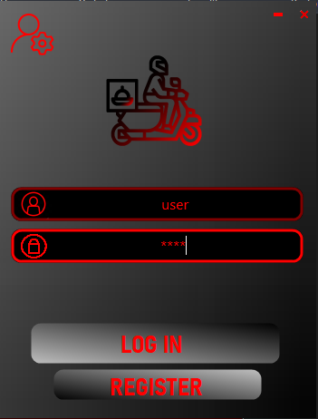
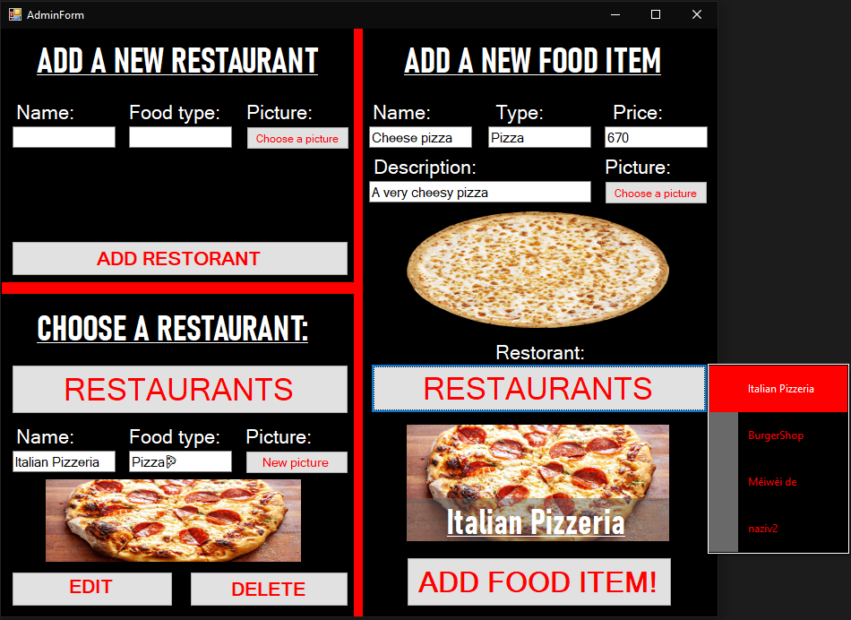
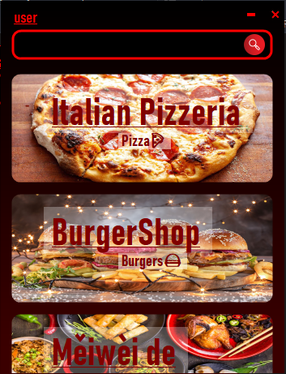
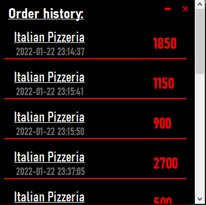
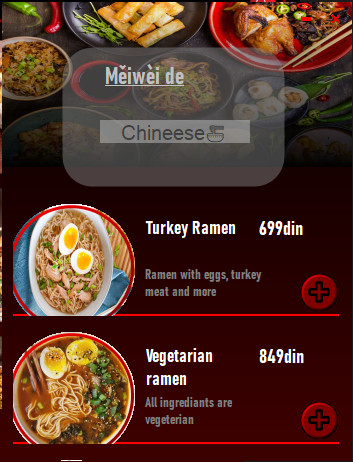
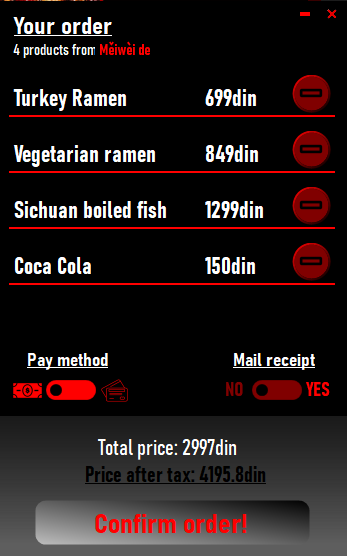
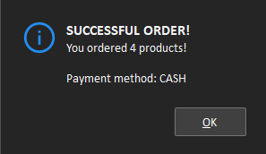

# Food delivery app
This project represents an application that allows users to browse through a variety of
restaurants, select their desired food items, place an order, check their order history and
even an admin menu for all CRUD operations. This app uses a database (MySQL) to keep
track of its: users, restaurants, food items and orders.

[Poor documentation of the project and its structure](CS322%20-%20Project%20Documentation%20-%204550.pdf)

## Build
In order to build you need to setup a local MySQL database (I use XAMPP), and import the provided [sql](322projekat.sql) file into your database.

After this you should be able to run the application without problems.

The default username and password combination used for testing is: `user`:`pass`

## Screenshots

### Log In

### Admin

### Restourants

### Past Orders

### Restaurant items

### Order

### Successful Order

